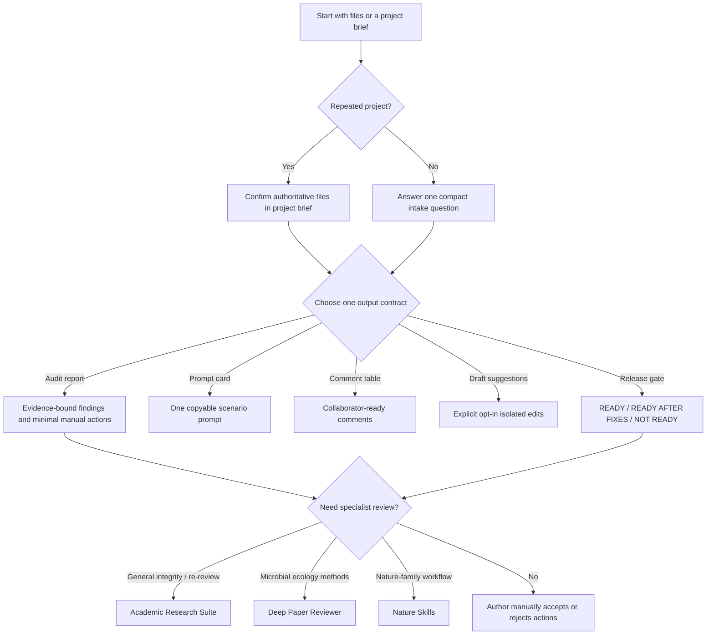

# Academic Revision Coach

An installable Codex plugin for the final, high-stakes stage of academic submission. It routes manuscript, response letter, cover letter, and supporting-information work to compact prompts that preserve author control.

The default is deliberately conservative: it prints a prioritized audit report and minimal manual actions. It does not silently rewrite your files, invent missing evidence, or turn every concern into generic prose.

## Version 0.2

`v0.2.0` adds the pieces that make a prompt workflow dependable across revision rounds:

- `project-brief.md` records the authoritative files, facts, constraints, and open decisions once.
- One output contract per task prevents a request for a prompt from becoming an unsolicited rewrite.
- Prompt cards give copyable, scenario-specific instructions without loading unrelated rules.
- A release gate returns an auditable `READY`, `READY AFTER FIXES`, or `NOT READY` decision.
- Mentor rules have evidence counts, confidence, scope, exceptions, and counterexamples.
- Four anonymized regression cases keep future changes tied to real failure modes.

## Why It Exists

The first release targets recurring problems in AI-assisted academic revision:

- Full-package drift: the manuscript, response letter, cover letter, and SI say slightly different things.
- Loss of author control: a model rewrites instead of identifying the smallest defensible change.
- Context and token waste: users repeatedly paste the entire paper for a narrow response-letter issue.
- Generic, verbose, or recognizably AI-like language.
- Mentor edits are useful but remain trapped in one Word file instead of becoming reusable, reviewable style rules.

The design is informed by public discussions and tools that emphasize human oversight, actionable comments, source fidelity, and package-level traceability. See [Research notes](docs/research-notes.md).

## What It Does

- Routes six scenarios: package audit, reviewer response, cover letter, supporting information, manuscript section, and mentor-style profiling.
- Defaults to `audit only`; drafting and direct editing require explicit user choice.
- Uses a reusable project brief and a minimal cross-document fact ledger before a package audit, then deduplicates findings by risk.
- Lets users supply an author voice profile and a mentor/advisor profile.
- Learns only through explicit user-approved profile updates.
- Escalates to installed specialist skills instead of reproducing their large workflows.

## How to Use

### 1. Install Once

Clone the repository, register its marketplace, and install the plugin:

```bash
git clone https://github.com/rsuag/academic-revision-coach.git
cd academic-revision-coach
codex plugin marketplace add .
codex plugin add submission-package-coach@academic-revision-coach
```

Start a new Codex task after installation so the skill is loaded.

### 2. Choose One Output

Say what you want to receive, not only what file you are supplying. The default is an audit report.

```text
Audit my submission package; print findings only.
Give me a prompt card for this reviewer response.
Turn these package findings into a collaborator comment table.
Run the final release gate on the authoritative submission files.
```

Do not ask for `draft suggestions` unless you want candidate replacement text. This is the only output mode that may propose wording.

### 3. Create a Brief for Any Repeated Project

Copy `plugins/submission-package-coach/templates/project-brief.md` into the manuscript project. Record one authoritative version for each file, the facts that must remain consistent, and any open author decision. Then say:

```text
Use this project brief. Audit the response letter and manuscript; print findings only.
```

The plugin asks only for missing details that affect the output. If no brief exists, it asks one compact intake question; it does not assume which of several document versions is authoritative.

### 4. Add Mentor Style Only When Useful

Supply representative tracked edits or comments, then say:

```text
Create a mentor-style profile from these edits. Do not save it until I approve the rules.
```

Review the extracted evidence count, confidence, scope, exceptions, and counterexamples. One-off edits remain low-confidence candidates instead of becoming permanent rules.

For work that will recur, first create a `project-brief.md` from `plugins/submission-package-coach/templates/project-brief.md`. This keeps version choices, package scope, and open author decisions visible without pasting the whole project into every task.

## Decision Flow



## Output Contracts

Choose one output type per request:

- `audit report`: evidence-bound findings and minimal manual actions.
- `prompt card`: one concise prompt to run elsewhere.
- `comment table`: collaborator-ready review comments.
- `draft suggestions`: isolated edits, only after explicit opt-in.
- `release gate`: final package decision with blocking evidence gaps.

The prompt cards and exact schemas live in `plugins/submission-package-coach/references/`; the skill loads only the relevant one.

## Profile Workflow

1. Copy `plugins/submission-package-coach/templates/author-style-profile.md` into your manuscript project if you want persistent voice preferences.
2. Supply representative mentor-tracked edits or comments and ask for a profile.
3. Review the extracted rules. Keep one-off edits as examples, not universal policy.
4. After a session, explicitly request a profile update based on accepted or rejected suggestions.

Do not commit confidential manuscripts, reviewer reports, or mentor annotations to this public repository.

## Similar Skills and the Boundary

This plugin is intentionally a thin, cross-document orchestration layer. It is not objectively better than the related skills; it is better suited to a narrow final-submission problem.

| Skill | Strongest use | What Academic Revision Coach adds | Choose the other skill when |
| --- | --- | --- | --- |
| `academic-research-suite` | Full research-to-paper workflow, integrity verification, citation checks, formal revision and re-review. | A compact project brief, one-output routing, manual-action-first package audit, and a lightweight final release decision. | You need full pipeline artifacts, citation verification, reviewer simulation, or formal traceability. |
| `deep-paper-reviewer` | Environmental microbiology, microbial ecology, and biogeochemistry methods, statistics, mechanisms, figures, and SI. | Discipline-neutral submission-package consistency and mentor/author style profiles without duplicating domain logic. | The question depends on domain mechanisms, statistical interpretation, or source-data review. |
| `nature-skills` | Nature-family writing, polishing, citation/data tasks, and reviewer-response workflows. | Cross-journal, audit-first coordination across all submitted files, with an explicit no-rewrite default. | The journal is Nature-family and you need its focused writing, data, citation, or response workflow. |

The advantage is therefore operational rather than rhetorical: fewer repeated context uploads, a clear boundary between audit and drafting, and a final decision whose evidence is visible to the author.

## Development

Validate the plugin:

```bash
python3 /Users/ruilinsu/.codex/skills/.system/plugin-creator/scripts/validate_plugin.py plugins/submission-package-coach
```

Run the regression contract before changing routes or prompt cards:

```bash
python3 -m unittest discover -s tests -v
```

The initial cases cover number drift, a response claiming an absent edit, SI-label drift, and over-generalizing one mentor edit. Add a sanitized fixture before changing a rule that fixes a new failure. Report regressions or narrow workflow requests through the GitHub issue templates. Never post confidential manuscripts, reviewer reports, data, or mentor annotations.

## License

MIT. See [LICENSE](LICENSE).
